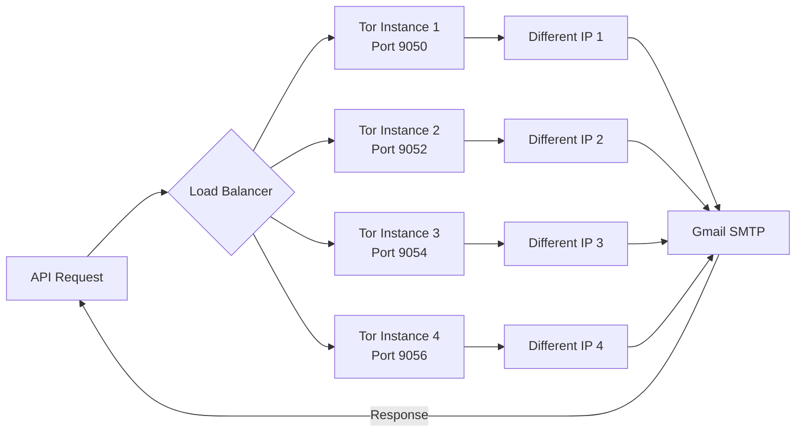

# Email Validator with Multi-Tor Proxy Rotation

[](https://github.com/rayeesansariwork/email-validator)
[](./docker-compose.yml)

**Free, open-source email verification API with built-in IP rotation** using multiple Tor instances to avoid Google blocking during bulk verification.

## ✨ Features

- ✅ **Email verification** without sending emails (SMTP validation)
- 🔄 **Automatic IP rotation** using 4 Tor instances
- 🚫 **Anti-blocking** - retries with different IPs when blacklisted
- 🚀 **Fast bulk processing** with async/concurrent requests
- 🐳 **Docker ready** - deploy anywhere in minutes
- 📊 **REST API** - easy integration
- 💰 **100% free** - no API keys or subscriptions needed

---

## 🚀 Quick Start with Docker

### Prerequisites

- Docker & Docker Compose installed
- Server with **port 25 outbound access** (for SMTP)

### 1. Clone and Configure

```bash
git clone https://github.com/rayeesansariwork/email-validator.git
cd email-validator

# Copy environment template
cp .env.example .env

# Edit .env with your email
nano .env
```

### 2. Start the Service

```bash
docker-compose up -d
```

**First startup takes ~3 minutes** while Tor instances bootstrap.

### 3. Test It

```bash
# Health check
curl http://localhost:8001/health

# Verify an email
curl -X POST http://localhost:8001/verify/single \
  -H "Content-Type: application/json" \
  -d '{"email":"test@gmail.com"}'
```

---

## 📡 API Endpoints

### Single Email Verification

**POST** `/verify/single`

```bash
curl -X POST http://localhost:8001/verify/single \
  -H "Content-Type: application/json" \
  -d '{
    "email": "someone@example.com",
    "proxy_port": 9050,
    "from_email": "your-email@gmail.com"
  }'
```

**Response:**
```json
{
  "email": "someone@example.com",
  "is_reachable": "safe",
  "mx": {
    "accepts_mail": true,
    "records": ["mx1.example.com"]
  },
  "smtp": {
    "can_connect_smtp": true,
    "is_deliverable": true,
    "is_disabled": false
  }
}
```

### Bulk Email Verification (Streaming)

**POST** `/verify/bulk/stream`

```bash
curl -X POST http://localhost:8001/verify/bulk/stream \
  -H "Content-Type: application/json" \
  -d '{
    "emails": ["email1@example.com", "email2@example.com"]
  }'
```

Returns Server-Sent Events (SSE) stream with real-time results.

---

## 🛠️ Local Development (without Docker)

### Prerequisites

- Python 3.11+
- Tor installed (`brew install tor` on Mac)

### Setup

```bash
# Install Python dependencies
pip install -r requirements.txt

# Download the binary
chmod +x download_binary.sh
./download_binary.sh

# Start Tor instances
./start_tor_instances.sh

# Wait for bootstrap (2-3 minutes)
sleep 120

# Test Tor rotation
./test_tor_rotation.sh

# Start API server
python app.py
```

---

## 🌐 Server Deployment

See [DEPLOYMENT.md](./DEPLOYMENT.md) for detailed guides for:

- ✅ **DigitalOcean** ($6/month) - Recommended
- ✅ **Hetzner** (€4/month) - Cheapest
- ✅ **AWS EC2** ($5-10/month)
- ✅ **Contabo** ($5/month)

> [!WARNING]
> **Port 25 is REQUIRED** for SMTP email verification. Platforms like Railway, Render, Heroku **won't work** because they block port 25.

---

## 📊 Performance

| Metric | Single Tor | 4 Tor Instances (This Project) |
|--------|------------|-------------------------------|
| **Emails before block** | ~10-20 | ~40-100 |
| **IP diversity** | 1 IP | 4 rotating IPs |
| **Recovery from block** | Manual | Automatic retry |
| **Concurrent requests** | Limited | 4x parallelization |

---

## 🔧 Configuration

### Environment Variables

Edit `.env` file:

```bash
# Your sender email
FROM_EMAIL=your-email@gmail.com

# Your domain (for SMTP HELO)
HELLO_NAME=your-domain.com

# Performance tuning
MAX_CONCURRENT=4              # Concurrent verifications
TIMEOUT_PER_EMAIL=90          # Timeout per email (seconds)
REQUEST_TIMEOUT_BULK=600      # Bulk request timeout (seconds)
```

### Tor Configuration

Edit `tor-configs/instance1.torrc` (and instance2-4) to customize:

```
# Rotate to new IP every 60 seconds
MaxCircuitDirtiness 60

# Faster circuit building
CircuitBuildTimeout 10
```

---

## 📖 How It Works



1. **Request comes in** → API selects a Tor instance
2. **SMTP verification** runs through that Tor proxy
3. **If IP blocked** → Automatically retries with different instance
4. **Tor rotates IPs** every 60 seconds automatically

---

## 🛑 Stopping the Service

```bash
# Docker
docker-compose down

# Local
./stop_tor_instances.sh
```

---

## 📚 Additional Resources

- [Quick Start Guide](./QUICK_START.md) - Get running in 3 steps
- [Deployment Guide](./DEPLOYMENT.md) - Detailed hosting instructions
- [Status & Troubleshooting](./STATUS.md) - Check Tor instances

---

## 🙏 Credits

Built on top of [check-if-email-exists](https://github.com/reacherhq/check-if-email-exists) by Reacher.

---

## 📝 License

This project is open source. The underlying `check-if-email-exists` tool is licensed under AGPL-3.0.

---

## 🐛 Issues & Support

Found a bug or need help? [Open an issue](https://github.com/rayeesansariwork/email-validator/issues)

---

**Made with ❤️ for the developer community**
