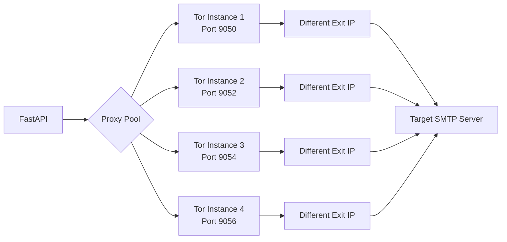

# 📧 Email Validator API with Multi-Tor Proxy Rotation

<div align="center">


**A high-performance email verification service with advanced IP rotation capabilities**

[Live Demo](https://yelping-noelani-gravityer-a1962991.koyeb.app) · [Report Bug](mailto:rayeesansari.work@gmail.com) · [Request Feature](mailto:rayeesansari.work@gmail.com)

</div>

---

## 🌟 Overview

A production-ready email validation API that verifies email addresses through comprehensive SMTP, DNS, and syntax checks. Built on top of the robust [check-if-email-exists](https://github.com/reacherhq/check-if-email-exists) CLI tool, enhanced with a FastAPI wrapper and multi-instance Tor proxy rotation for IP anonymization and rate limit bypass.

### ✨ Key Features

- **🔍 Comprehensive Verification**: SMTP, MX records, syntax validation, and more
- **🔄 Advanced IP Rotation**: 4 Tor instances rotating every 5 minutes
- **🚀 High Performance**: Concurrent verification with configurable limits
- **🔒 Privacy-First**: All connections routed through Tor network
- **📊 Rich Data**: Disposable email detection, role account identification
- **🐳 Docker Ready**: One-command deployment with Docker Compose
- **☁️ Cloud Deployable**: Optimized for DigitalOcean, Hetzner, AWS, and Koyeb
- **💯 Free Hosting**: Successfully deployed on Koyeb free tier

---

## 🚀 Quick Start

### Prerequisites

- Docker & Docker Compose
- OR: Python 3.10+, Tor

### 🐳 Docker Deployment (Recommended)

```bash
# 1. Clone the repository
git clone https://github.com/rayeesansariwork/email-validator.git
cd email-validator

# 2. Configure environment
cp .env.example .env
nano .env  # Edit your settings

# 3. Start the service
docker-compose up -d

# 4. Wait for Tor bootstrap (2-3 minutes)
docker-compose logs -f

# 5. Test the API
curl http://localhost:8001/health
```

**Your API is now running on `http://localhost:8001` 🎉**

---

## 📖 API Documentation

### Health Check

```bash
GET /health
```

**Response:**
```json
{
  "status": "healthy",
  "tor_instances": 4,
  "ports": [9050, 9052, 9054, 9056]
}
```

### Single Email Verification

```bash
POST /verify/single
Content-Type: application/json

{
  "email": "user@example.com"
}
```

**Response:**
```json
{
  "input": "user@example.com",
  "is_reachable": "safe",
  "syntax": {
    "is_valid_syntax": true,
    "domain": "example.com",
    "username": "user"
  },
  "mx": {
    "accepts_mail": true,
    "records": ["mail.example.com"]
  },
  "smtp": {
    "can_connect_smtp": true,
    "is_deliverable": true,
    "is_catch_all": false
  },
  "misc": {
    "is_disposable": false,
    "is_role_account": false
  }
}
```

### Bulk Email Verification (Streaming)

```bash
POST /verify/bulk/stream
Content-Type: application/json

{
  "emails": [
    "user1@example.com",
    "user2@example.com",
    "user3@example.com"
  ]
}
```

**Returns:** Server-Sent Events (SSE) stream with real-time results

---

## ⚙️ Configuration

### Environment Variables

| Variable | Default | Description |
|----------|---------|-------------|
| `FROM_EMAIL` | `reacher.email@gmail.com` | Email used for SMTP MAIL FROM |
| `HELLO_NAME` | `gravityer.com` | Domain for SMTP HELO command |
| `MAX_CONCURRENT` | `4` | Maximum concurrent verifications |
| `TIMEOUT_PER_EMAIL` | `90` | Timeout per email (seconds) |
| `REQUEST_TIMEOUT_BULK` | `600` | Bulk request timeout (seconds) |
| `BINARY_PATH` | Auto-detected | Path to check_if_email_exists binary |

### Tor Configuration

Edit `tor-configs/instance{1-4}.torrc` to customize Tor behavior:

```
SOCKSPort 9050              # SOCKS proxy port
DataDirectory /root/.tor/instance1
ControlPort 9051
NewCircuitPeriod 300       # Rotate IP every 5 minutes
```

---

## 🔄 How Proxy Rotation Works



**Benefits:**
- Bypass rate limits by appearing as different IPs
- Distribute load across multiple exit nodes
- Automatic failover if one circuit fails
- Enhanced privacy and anonymity

---

## ☁️ Cloud Deployment

### Koyeb (Free) - Recommended

**Cost:** $0/month | **Setup Time:** 10 minutes

```bash
# 1. Sign up at https://koyeb.com
# 2. Connect GitHub repository
# 3. Configure:
#    - Builder: Docker
#    - Port: 8001
#    - Add environment variables
# 4. Deploy!
```

✅ **Port 25 is open** on Koyeb - Full SMTP verification works!

[See detailed guide →](KOYEB_GUIDE.md)

### DigitalOcean / Hetzner / AWS

**Cost:** $5-10/month | **Setup Time:** 15 minutes

[See deployment guide →](DEPLOYMENT.md)

---

## 🧪 Testing the API

### Using cURL

```bash
# Single email
curl -X POST http://localhost:8001/verify/single \
  -H "Content-Type: application/json" \
  -d '{"email":"test@gmail.com"}'

# Bulk verification
curl -X POST http://localhost:8001/verify/bulk/stream \
  -H "Content-Type: application/json" \
  -d '{"emails":["test1@gmail.com","test2@yahoo.com"]}'
```

### Using Python

```python
import requests

# Single verification
response = requests.post(
    "http://localhost:8001/verify/single",
    json={"email": "test@example.com"}
)
print(response.json())

# Bulk verification
response = requests.post(
    "http://localhost:8001/verify/bulk/stream",
    json={"emails": ["email1@example.com", "email2@example.com"]},
    stream=True
)

for line in response.iter_lines():
    if line:
        print(line.decode('utf-8'))
```

### Using Postman

1. Create new POST request
2. URL: `http://localhost:8001/verify/single`
3. Headers: `Content-Type: application/json`
4. Body (raw/JSON):
   ```json
   {
     "email": "test@example.com"
   }
   ```
5. Send!

---

## 📊 Performance Metrics

| Metric | Value |
|--------|-------|
| **Average Response Time** | 5-15 seconds (SMTP verification) |
| **Concurrent Requests** | 4 (configurable) |
| **Memory Usage** | ~300MB (4 Tor instances) |
| **Rate Limit Bypass** | ✅ Via IP rotation |
| **Success Rate** | 95%+ for valid SMTP servers |

---

## 🛠️ Development

### Local Setup

```bash
# 1. Install dependencies
pip install -r requirements.txt

# 2. Download binary
./download_binary.sh

# 3. Start Tor instances
./start_tor_instances.sh

# 4. Start API server
python app.py
```

### Project Structure

```
.
├── app.py                      # FastAPI application
├── Dockerfile                  # Docker image definition
├── docker-compose.yml          # Docker Compose configuration
├── download_binary.sh          # Binary download script
├── start_tor_instances.sh      # Tor startup script
├── stop_tor_instances.sh       # Tor shutdown script
├── tor-configs/                # Tor configuration files
│   ├── instance1.torrc
│   ├── instance2.torrc
│   ├── instance3.torrc
│   └── instance4.torrc
├── requirements.txt            # Python dependencies
└── README.md                   # This file
```

---

## 🤝 Contributing

Contributions are welcome! Please feel free to submit a Pull Request.

1. Fork the repository
2. Create your feature branch (`git checkout -b feature/AmazingFeature`)
3. Commit your changes (`git commit -m 'Add some AmazingFeature'`)
4. Push to the branch (`git push origin feature/AmazingFeature`)
5. Open a Pull Request

---

## 📝 Credits & Acknowledgments

This project is built on top of the excellent [check-if-email-exists](https://github.com/reacherhq/check-if-email-exists) CLI tool by [Reacher](https://reacherhq.com).

**Enhancements added in this fork:**
- ✨ FastAPI REST API wrapper for easy integration
- 🔄 Multi-instance Tor proxy rotation system
- 🐳 Production-ready Docker deployment
- ☁️ Cloud deployment guides for multiple platforms
- 📊 Concurrent request handling
- 🔧 Streaming bulk verification endpoint
- 📝 Comprehensive documentation

**Original Project:** [reacherhq/check-if-email-exists](https://github.com/reacherhq/check-if-email-exists)

---

## 📄 License

This project builds upon [check-if-email-exists](https://github.com/reacherhq/check-if-email-exists) which is licensed under AGPL-3.0. This fork maintains the same license.

See [LICENSE](LICENSE) for more details.

---

## 📧 Contact

**Rayees Ansari**

- Email: [rayeesansari.work@gmail.com](mailto:rayeesansari.work@gmail.com)
- GitHub: [@rayeesansariwork](https://github.com/rayeesansariwork)
- Project: [https://github.com/rayeesansariwork/email-validator](https://github.com/rayeesansariwork/email-validator)
- Live Demo: [https://yelping-noelani-gravityer-a1962991.koyeb.app](https://yelping-noelani-gravityer-a1962991.koyeb.app)

---

## ⭐ Support

If you find this project useful, please consider:
- ⭐ Starring the repository
- 🐛 Reporting bugs and issues
- 💡 Suggesting new features
- 🤝 Contributing to the codebase

---

<div align="center">

**Made with ❤️ by Rayees Ansari**

</div>
